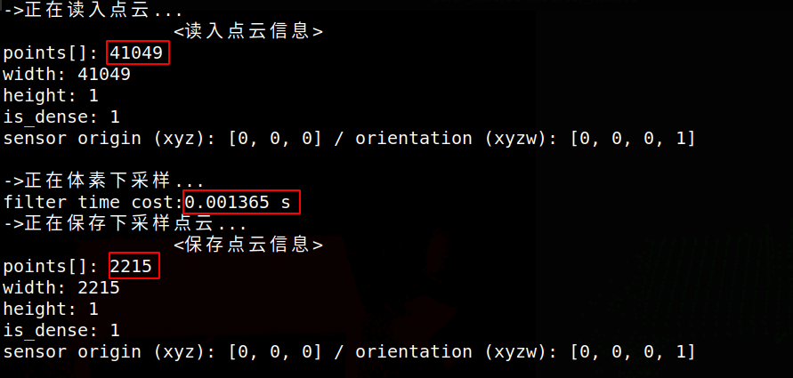
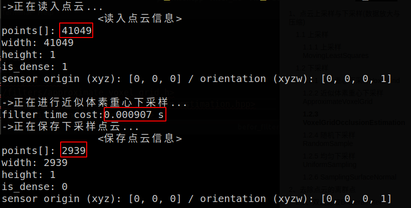
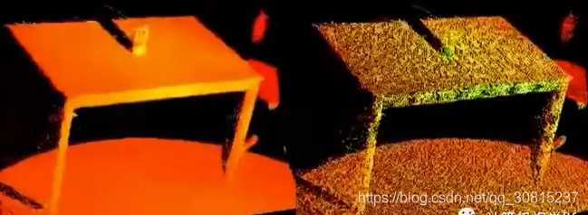
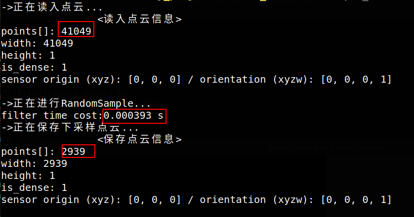

 <h1 align = "center">点云常用去噪声方法</h1>

PCL中总结了几种需要进行点云滤波处理的情况，如下：

1. 点云数据密度不规则需要平滑
2. 因遮挡等问题噪声的离群点需要去除
3. 数据冗余需要下采样
4. 噪声数据需要去除

对应的方法如下：

1. 按具体给定的规则过滤点
2. 通过滤波算法修改点的部分属性
3. 点云数据下采样

[代码框架](https://github.com/Aviana-Zheng/pcl_filter)

# 1、点云上采样与下采样(数据放大与压缩)

放大图像（或称为上采样（`upsampling`）或图像插值（`interpolating`））的主要目的是放大原图像,从而可以显示在更高分辨率的显示设备上。

上采样（`upsampling`）的实现，容易想到三种方式，分别对应最大池化、平均池化和卷积操作的反过来使用。1、插值法；2、反池化；3、反卷积。

缩小图像（或称为下采样（`subsampled`）或降采样（`downsampled`））的主要目的有两个：1、使得图像符合显示区域的大小；2、生成对应图像的缩略图。

下采样定义：对于一个样值序列间隔几个样值取样一次，这样得到新序列就是原序列的下采样。

下采样就是抽取，是多速率信号处理中的基本内容之一。

下采样用池化层也可以用卷积，把卷积的步长设为2一般就可以缩小一倍了。比如`YOLOv3`中用的`Darknet-53`

## 1.1 上采样

### 1.1.1 上采样MovingLeastSquares


## 1.2 下采样

### 1.2.1 体素重心下采样VoxelGrid

```c++
class  pcl::VoxelGrid< PointT >
class  pcl::VoxelGrid< pcl::PCLPointCloud2 >
```

官网的描述:

```
	VoxelGrid assembles a local 3D grid over a given PointCloud, and downsamples + filters the data
	The VoxelGrid class creates a 3D voxel grid (think about a voxel grid as a set of tiny 3D boxes in space) over the input point cloud data. Then, in each voxel (i.e., 3D box), all the points present will be approximated (i.e., downsampled) with their centroid. This approach is a bit slower than approximating them with the center of the voxel, but it represents the underlying surface more accurately.
```

比较适合对海量的点云在处理前进行数据压缩，而且可以在特征提取等处理中选择合适的体素（voxel）大小等参数，提高算法效率。该函数对输入的点云数据创建一个三维体素栅格，每个体素内用体素中所有点的重心来近似显示体素中其他点，这样该体素内所有点都用一个重心点最终表示。用每个体素重心近似代替体素中的其他点。这种方法比用体素中心来逼近的方法更慢，但它对于采样点对应曲面的表示更为准确。

它的优点是可以在下采样的时候保存点云的形状特征。

<font color = red>这种方法有几个缺点：</font>

- <font color = red>与使用体素中心和近似体素重心下采样相比，它需要更长的处理时间；</font>
- <font color = red>它对嘈杂的输入空间敏感；</font>
- <font color = red>它不能准确地表示下垫面（underlying surface）</font>

所需头文件为：

```c++
#include <pcl/filters/voxel_grid.h>
#include <pcl/filters/impl/voxel_grid.hpp>
```

代码实现：

```c++
pcl::VoxelGrid<PointT> downSampled;  //创建滤波对象
    cout << "->正在体素下采样..." << endl;
    pcl::VoxelGrid<pcl::PointXYZ> downSampled;  //创建滤波对象
    downSampled.setInputCloud (cloud);            //设置需要过滤的点云给滤波对象
    downSampled.setLeafSize (0.05f, 0.05f, 0.05f);  //设置滤波时创建的体素体积为5cm的立方体，三个参数表示体素栅格叶大小，分别表示体素在XYZ方向的尺寸
    downSampled.setDownsampleAllData(false);     //设置是否对所有的字段进行下采样
    downSampled.filter (*cloud_filtered);           //执行滤波处理，存储输出
```

`setDownsampleAllData`的意思是：点云有不同的类型，比如 `PointXYZ`，有的是`PointXYZRGB`，还有其他类型，也就是一个点包含多种不同信息，比如空间位置`XYZ`，颜色信息`RGB`，或者强度信息等，如果想要对所有信息（字段）下采样则设置为`true`，只对`XYZ`下采样的话设置为`false`。下采样结果如下图所示。




### 1.2.2 近似体素重心下采样ApproximateVoxelGrid

`ApproximateVoxelGrid`近似体素滤波企图以 **更快的速度** 实现与`VoxelGrid` 体素滤波相同的下采样，它通过 [**散列函数**（Hashing Function）](https://zhuanlan.zhihu.com/p/49435564)**快速逼近质心**，而不是精细确定质心并对点云进行下采样。采样结果是近似逼近的体素质心，并不是体素中心。

```c++
class  pcl::ApproximateVoxelGrid< PointT >
```

官网的描述:

```
	ApproximateVoxelGrid assembles a local 3D grid over a given PointCloud, and downsamples + filters the data. 
```

所需头文件为：

```c++
#include <pcl/filters/approximate_voxel_grid.h>
#include <pcl/filters/impl/voxel_grid_occlusion_estimation.hpp>
```

代码实现：

```c++
	cout << "->正在进行近似体素重心下采样..." << endl;
	pcl::ApproximateVoxelGrid<pcl::PointXYZ> avg;	//创建滤波器对象
	avg.setInputCloud(cloud);						//设置待滤波点云
	avg.setLeafSize(0.05f, 0.05f, 0.05f);			//设置滤波时创建的体素体积为5cm的立方体，三个参数表示体素栅格叶大小，分别表示体素在XYZ方向的尺寸
	avg.setDownsampleAllData(false);				//如果只有XYZ字段，则设置为false，如果对所有字段，如intensity，都进行下采样，则设置为true
	avg.filter(*cloud_filtered);							//执行下采样，保存结果于cloud_sub
```

`setDownsampleAllData`的意思是：点云有不同的类型，比如 `PointXYZ`，有的是`PointXYZRGB`，还有其他类型，也就是一个点包含多种不同信息，比如空间位置`XYZ`，颜色信息`RGB`，或者强度信息等，如果想要对所有信息（字段）下采样则设置为`true`，只对`XYZ`下采样的话设置为`false`。下采样结果如下图所示。





**近似体素下采样** 比 **体素下采样** 获取的下采样点数多，且耗时短。

### 1.2.3 VoxelGridOcclusionEstimation


```c++
class  pcl::VoxelGridOcclusionEstimation< PointT >
```

官网的描述：

```
	VoxelGrid to estimate occluded space in the scene.
	The ray traversal algorithm is implemented by the work of 'John Amanatides and Andrew Woo, A Fast Voxel Traversal Algorithm for Ray Tracing'
```

所需头文件为：

```c++
#include <pcl/filters/voxel_grid_occlusion_estimation.h>
#include <pcl/filters/impl/voxel_grid_occlusion_estimation.hpp>
```


### 1.2.4 随机下采样RandomSample

首先指定要下采样的点数，然后随机进行采样。

```c++
class  pcl::RandomSample< PointT >
class  pcl::RandomSample< pcl::PCLPointCloud2 >
```

官网的描述:

```
	RandomSample applies a random sampling with uniform probability.//均等概率

	Based off Algorithm A from the paper "Faster Methods for Random Sampling" by Jeffrey Scott Vitter. The algorithm runs in O(N) and results in sorted indices http://www.ittc.ku.edu/~jsv/Papers/Vit84.sampling.pdf 
```

所需头文件为：

```c++
#include <pcl/filters/random_sample.h>
#include <pcl/filters/impl/random_sample.hpp>
```

代码实现：

```c++
	cout << "->正在进行RandomSample..." << endl;
	pcl::RandomSample<pcl::PointXYZ> rs;	//创建滤波器对象
	rs.setInputCloud(cloud);				//设置待滤波点云
	rs.setSample(2939);					//设置下采样点云的点数,同ApproximateVoxelGrid对比，设置2939个点
	//rs.setSeed(1);						//设置随机函数种子点
	rs.filter(*cloud_filtered);					//执行下采样滤波，保存滤波结果于cloud_sub
```

采样结果如下图所示。




在相同的采样点数下，随机下采样比近似体素下采样耗时短，但是采样结果丧失了一部分点云的形状特征。

### 1.2.5 均匀下采样UniformSampling 

[pcl::UniformSampling< PointT >](https://pointclouds.org/documentation/classpcl_1_1_uniform_sampling.html)

### 1.2.6 SamplingSurfaceNormal

pcl::SamplingSurfaceNormal< PointT >


# 2、去除点云的离群点

## 2.1、双边滤波BilateralFilter

官网描述为：

```
A bilateral filter implementation for point cloud data.
```

`BilateralFilter`是对双边滤波算法在点云上的实现，该类的实现利用的并非`XYZ`字段的数据进行，而是利用强度数据进行双边滤波算法的实现，所以在使用该类时点云的类型必须有强度字段，否则无法进行双边滤波处理（所以在用这个函数的时候是需要注意自己输入点云的数据格式的，需要包含点云的强度信息）

```c++
pcl::BilateralFilter< PointT >
```

所需头文件为：

```c++
#include <pcl/filters/bilateral.h>
```

代码实现为：

```c++
// 双边滤波
pcl::search::KdTree<pcl::PointXYZI>::Ptr tree(new pcl::search::KdTree<pcl::PointXYZI>);
pcl::BilateralFilter<pcl::PointXYZI> bf;
bf.setInputCloud(cloud);
bf.setSearchMethod(tree);
bf.setHalfSize(0.1);	// 设置高斯双边滤波窗口的一半大小,即搜索半径。
bf.setStdDev(0.03);		// 设置标准差参数
bf.filter(*outcloud);
```


## 2.2、统计滤波器**StatisticalOutlierRemoval** 

基于统计学去噪，先求取全局点云距离分布，然后依次判断每个采样点与其邻域的距离是否满足阈值。

[pcl::StatisticalOutlierRemoval< PointT >](https://pointclouds.org/documentation/classpcl_1_1_statistical_outlier_removal.html)

[pcl::StatisticalOutlierRemoval< pcl::PCLPointCloud2 >](https://pointclouds.org/documentation/classpcl_1_1_statistical_outlier_removal_3_01pcl_1_1_p_c_l_point_cloud2_01_4.html)


## 2.3、半径滤波器**RadiusOutlierRemoval**

[pcl::RadiusOutlierRemoval< PointT >](https://pointclouds.org/documentation/classpcl_1_1_radius_outlier_removal.html)

[pcl::RadiusOutlierRemoval< pcl::PCLPointCloud2 >](https://pointclouds.org/documentation/classpcl_1_1_radius_outlier_removal_3_01pcl_1_1_p_c_l_point_cloud2_01_4.html)


## 2.4、模型滤波器ModelOutlierRemoval 


## 2.4、基于点云频率的滤波方法


# 3、点云空间裁剪

## 3.1 直通滤波器**PassThrough** 

[pcl::PassThrough< PointT >](https://pointclouds.org/documentation/classpcl_1_1_pass_through.html)

[pcl::PassThrough< pcl::PCLPointCloud2 >](https://pointclouds.org/documentation/classpcl_1_1_pass_through_3_01pcl_1_1_p_c_l_point_cloud2_01_4.html)


## 3.2 条件滤波器ConditionRemoval 


## 3.3 滤波器CropHull


## 3.4  滤波器CropBox

[pcl::CropBox< PointT >](https://pointclouds.org/documentation/classpcl_1_1_crop_box.html)

[pcl::CropBox< pcl::PCLPointCloud2 >](https://pointclouds.org/documentation/classpcl_1_1_crop_box_3_01pcl_1_1_p_c_l_point_cloud2_01_4.html)

## 3.5 滤波器BoxClipper3D


## 3.6 滤波Clipper3D


# 4、 提取指定范围内的点云

## 4.1 索引提取ExtractIndices 

[pcl::ExtractIndices< PointT >](https://pointclouds.org/documentation/classpcl_1_1_extract_indices.html)

[pcl::ExtractIndices< pcl::PCLPointCloud2 >](https://pointclouds.org/documentation/classpcl_1_1_extract_indices_3_01pcl_1_1_p_c_l_point_cloud2_01_4.html)


# 5、 平滑点云数据密度


## 5.1 高斯滤波GaussianKernel

[pcl::filters::Convolution< PointIn, PointOut >](https://pointclouds.org/documentation/classpcl_1_1filters_1_1_convolution.html)

[pcl::filters::ConvolvingKernel< PointInT, PointOutT >](https://pointclouds.org/documentation/classpcl_1_1filters_1_1_convolving_kernel.html)

[pcl::filters::GaussianKernelRGB< PointInT, PointOutT >](https://pointclouds.org/documentation/classpcl_1_1filters_1_1_gaussian_kernel_r_g_b.html)


[pcl::experimental::advanced::FunctorFilter< PointT, FunctionObject >](https://pointclouds.org/documentation/classpcl_1_1experimental_1_1advanced_1_1_functor_filter.html)

[pcl::Filter< PointT >](https://pointclouds.org/documentation/classpcl_1_1_filter.html)

[pcl::Filter< pcl::PCLPointCloud2 >](https://pointclouds.org/documentation/classpcl_1_1_filter_3_01pcl_1_1_p_c_l_point_cloud2_01_4.html)


[pcl::FilterIndices< PointT >](https://pointclouds.org/documentation/classpcl_1_1_filter_indices.html)

[pcl::FilterIndices< pcl::PCLPointCloud2 >](https://pointclouds.org/documentation/classpcl_1_1_filter_indices_3_01pcl_1_1_p_c_l_point_cloud2_01_4.html)

[pcl::FrustumCulling< PointT >](https://pointclouds.org/documentation/classpcl_1_1_frustum_culling.html)

[pcl::GridMinimum< PointT >](https://pointclouds.org/documentation/classpcl_1_1_grid_minimum.html)

[pcl::LocalMaximum< PointT >](https://pointclouds.org/documentation/classpcl_1_1_local_maximum.html)

[pcl::MedianFilter< PointT >](https://pointclouds.org/documentation/classpcl_1_1_median_filter.html)

[pcl::NormalRefinement< NormalT >](https://pointclouds.org/documentation/classpcl_1_1_normal_refinement.html)

[pcl::NormalSpaceSampling< PointT, NormalT >](https://pointclouds.org/documentation/classpcl_1_1_normal_space_sampling.html)


[pcl::PlaneClipper3D< PointT >](https://pointclouds.org/documentation/classpcl_1_1_plane_clipper3_d.html)

[pcl::ProjectInliers< PointT >](https://pointclouds.org/documentation/classpcl_1_1_project_inliers.html)

[pcl::ProjectInliers< pcl::PCLPointCloud2 >](https://pointclouds.org/documentation/classpcl_1_1_project_inliers_3_01pcl_1_1_p_c_l_point_cloud2_01_4.html)


[pcl::ShadowPoints< PointT, NormalT >](https://pointclouds.org/documentation/classpcl_1_1_shadow_points.html)

# 6、去除点云Nan数据

void [pcl::removeNaNFromPointCloud](https://pointclouds.org/documentation/group__filters.html#ga9de762e05951938f074479c3bf8ae084) (const [pcl::PointCloud](https://pointclouds.org/documentation/classpcl_1_1_point_cloud.html)< [PointT](https://pointclouds.org/documentation/structpcl_1_1_point_x_y_z_r_g_b.html) > &cloud_in, [pcl::PointCloud](https://pointclouds.org/documentation/classpcl_1_1_point_cloud.html)< [PointT](https://pointclouds.org/documentation/structpcl_1_1_point_x_y_z_r_g_b.html) > &cloud_out, [Indices](https://pointclouds.org/documentation/namespacepcl.html#a8bfe09b8680e7129dd0fd6177c1a2ce6) &index)


void [pcl::removeNaNNormalsFromPointCloud](https://pointclouds.org/documentation/group__filters.html#ga8156e210186174a05af6251a2932006a) (const [pcl::PointCloud](https://pointclouds.org/documentation/classpcl_1_1_point_cloud.html)< [PointT](https://pointclouds.org/documentation/structpcl_1_1_point_x_y_z_r_g_b.html) > &cloud_in, [pcl::PointCloud](https://pointclouds.org/documentation/classpcl_1_1_point_cloud.html)< [PointT](https://pointclouds.org/documentation/structpcl_1_1_point_x_y_z_r_g_b.html) > &cloud_out, [Indices](https://pointclouds.org/documentation/namespacepcl.html#a8bfe09b8680e7129dd0fd6177c1a2ce6) &index)


void [pcl::removeNaNFromPointCloud](https://pointclouds.org/documentation/group__filters.html#ga0839c52ff34eb1f6ffc58cf5cc853bd8) (const [pcl::PointCloud](https://pointclouds.org/documentation/classpcl_1_1_point_cloud.html)< [PointT](https://pointclouds.org/documentation/structpcl_1_1_point_x_y_z_r_g_b.html) > &cloud_in, [Indices](https://pointclouds.org/documentation/namespacepcl.html#a8bfe09b8680e7129dd0fd6177c1a2ce6) &index)

 # 7、其他

void [pcl::applyMorphologicalOperator](https://pointclouds.org/documentation/group__filters.html#gab8ec453347225d3a0d34c70e0a9ee223) (const typename [pcl::PointCloud](https://pointclouds.org/documentation/classpcl_1_1_point_cloud.html)< [PointT](https://pointclouds.org/documentation/structpcl_1_1_point_x_y_z_r_g_b.html) >::ConstPtr &cloud_in, float resolution, const int morphological_operator, [pcl::PointCloud](https://pointclouds.org/documentation/classpcl_1_1_point_cloud.html)< [PointT](https://pointclouds.org/documentation/structpcl_1_1_point_x_y_z_r_g_b.html) > &cloud_out)


std::vector<float> [pcl::assignNormalWeights](https://pointclouds.org/documentation/group__filters.html#ga2fa1a673ddb4fce5d408141a0f7f10ec) (const [PointCloud](https://pointclouds.org/documentation/classpcl_1_1_point_cloud.html)< [NormalT](https://pointclouds.org/documentation/structpcl_1_1_normal.html) > &cloud, [index_t](https://pointclouds.org/documentation/namespacepcl.html#a45edbae979af563e6a1e39fd1aad3911) index, const [Indices](https://pointclouds.org/documentation/namespacepcl.html#a8bfe09b8680e7129dd0fd6177c1a2ce6) &k_indices, const std::vector< float > &k_sqr_distances)


bool [pcl::refineNormal](https://pointclouds.org/documentation/group__filters.html#ga97a19f59a33da441d2e7ba35506627ad) (const [PointCloud](https://pointclouds.org/documentation/classpcl_1_1_point_cloud.html)< [NormalT](https://pointclouds.org/documentation/structpcl_1_1_normal.html) > &cloud, int index, const [Indices](https://pointclouds.org/documentation/namespacepcl.html#a8bfe09b8680e7129dd0fd6177c1a2ce6) &k_indices, const std::vector< float > &k_sqr_distances, [NormalT](https://pointclouds.org/documentation/structpcl_1_1_normal.html) &point)


Eigen::MatrixXi [pcl::getHalfNeighborCellIndices](https://pointclouds.org/documentation/group__filters.html#gaffa333cb2c210067835f11bf84feb659) ()

Eigen::MatrixXi  [pcl::getAllNeighborCellIndices](https://pointclouds.org/documentation/group__filters.html#ga6a35c2d72627c558cb22b85d1f2c0679) ()

void [pcl::getMinMax3D](https://pointclouds.org/documentation/group__filters.html#gaaff287f132f05316c896e410d689569b) (const typename [pcl::PointCloud](https://pointclouds.org/documentation/classpcl_1_1_point_cloud.html)< [PointT](https://pointclouds.org/documentation/structpcl_1_1_point_x_y_z_r_g_b.html) >::ConstPtr &cloud, const std::string &distance_field_name,  float min_distance, float max_distance, Eigen::Vector4f &min_pt,  Eigen::Vector4f &max_pt, bool limit_negative=false)


void [pcl::getMinMax3D](https://pointclouds.org/documentation/group__filters.html#ga11cf5b99837ee9ed5e5e85e87f12c075) (const typename [pcl::PointCloud](https://pointclouds.org/documentation/classpcl_1_1_point_cloud.html)< [PointT](https://pointclouds.org/documentation/structpcl_1_1_point_x_y_z_r_g_b.html) >::ConstPtr &cloud, const [Indices](https://pointclouds.org/documentation/namespacepcl.html#a8bfe09b8680e7129dd0fd6177c1a2ce6) &indices, const std::string &distance_field_name, float  min_distance, float max_distance, Eigen::Vector4f &min_pt,  Eigen::Vector4f &max_pt, bool limit_negative=false)


## 1、基于密度的去噪


- 判断当前点的邻域点数，过小则将其视为噪音点

- 

## 3、直通滤波去噪


- 在 X、Y、Z 方向设置阈值对点云进行截取（快速去除离群点用）

## 4、手动去燥


- 人机交互框选不感兴趣点云并删除

## 5、基于假设检验的粗差剔除


- 假设点云数据仅在一个维度上存在误差，则对每一点利用其邻域点的属性值对其进行拟合，并求取拟合后的值与原始属性的差值。根据偶然误差服从正态分布的特性，通过设定一个置信区间，将误差值较大的点视为噪音点或失真点进行剔除

## 6、基于横切分层剔除噪音


- 这里通过对点云的高程 进行横切分层，然后，统计每个分割区域内的点云数量， 将分割区内小于一定阈值的点作为粗差予以清除

## 7、基于点到平面距离去噪


- 通过判断邻近点云数据的拟合平面，将离拟合平面距离值为负的点云看作噪声点云数据

## 8、移动平滑法


- 通过移动平滑法与二次多项式拟合曲面的方法去除噪声

## 9、中值滤波去噪


- 详见中值滤波


# 参考：

1、[官网](https://pointclouds.org/documentation/group__filters.html)

2、《点云库PCL从入门到精通》郭浩

3、[PCL：点云滤波汇总：算法原理 + 代码实现](https://blog.csdn.net/weixin_46098577/article/details/114385690)

4、[PCL点云滤波去噪](https://blog.csdn.net/qq_30815237/article/details/86294496)

5、[PCL点云数据处理基础目录](https://blog.csdn.net/weixin_46098577/article/details/119972670?spm=1001.2014.3001.5501)

6、[PCL源码分析-pcl/filter/sampling_surface_normal.h](https://blog.csdn.net/qq_34792438/article/details/114363189)

